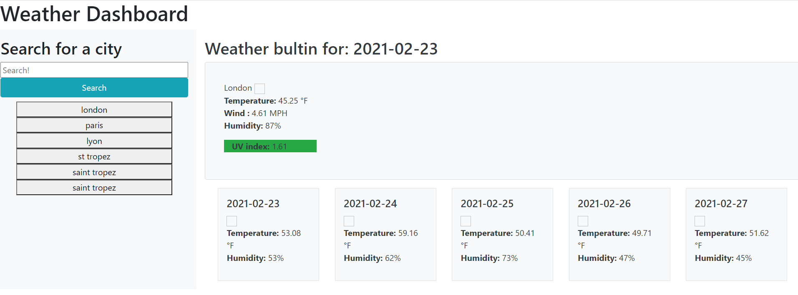

# weather-app

## Project goal:

Creating a weather app capable of the following:

1. search the weather for any city
2. the result will includes: date of the day, name of the city, icon describing the weather, temperature, wind speed, humiditiy  UV index.
3. the UV index will have a color coresponding to how dengerous it is to stay exposed for a long period.
4. forcast for the following 5 days with: date of the day, icon describing the weather, temperature, and humiditiy.
5. Every city entered will be saved as a button and with a click will be able to retreive the weather for that city.

## Links:
GitHub ripo:
https://github.com/zpinson/weather-app

Live link:
https://zpinson.github.io/weather-app

## Screen shot:

